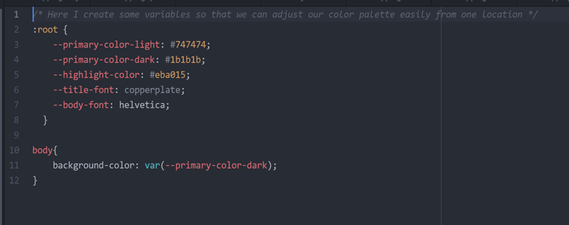

# **Mapping Incidents of Traffic Violence across MA**
Wab Mapping & Open Source GIS | Fall 2021
-----------------------------------------------------------------------------------------------
### Instructor: Professor Korde
### Tom Francis, Zainab Farid, and Kasyan Green

## Introduction

Since the introduction of gas powered vehicles in the early 20th century, public ways have been slowly transformed from spaces where pedestrians, equestrians, bicyclists 
and motorists mingled together to roadways designed exclusively for and devoted exclusively to motorists. The methods of transformation could be informal, such as coining 
the term “jaywalker” to discourage pedestrians from entering the roadway except at designated locations (“jay” was a pejorative term roughly equivalent to “country bumpkin”).
Or formal, as with the 85th percentile standard for setting speed limits. Using the 85th percentile, speed limits are set to the speed at or below which 85 percent of all 
drivers are observed to travel under free-flowing conditions. In other words, the vast majority of speed limits are set without any consideration of the safety of drivers, 
passengers or other roadway users.  

The Vision Zero movement seeks to re-design roadways to be safe and comfortable for all users. Vision Zero design standards prioritize the safety of all users as opposed 
to accommodating the greatest volume of motorists. Vision Zero was conceived and signed into law in Sweden in 1997. In 2019, Oslo Norway was the first major city to 
achieve zero traffic fatalities for vulnerable roadway users. Vulnerable roadway users are primarily pedestrians and bicyclists, but also include wheelchair users and 
those using micro mobility.  

The [Massachusetts Vision Zero Coalition](https://www.visionzerocoalition.org/) advocates for Vision Zero design standards on Beacon Hill and in the Commonwealth’s 351
municipalities. As part of their advocacy, 
they track pedestrian and bicyclist fatalities based on media accounts. The fatalities are visualized on their website. The visualization is accomplished using Google My
Maps. Current Massachusetts vulnerable user fatalities exceed the number of points allowed by Google My Maps. The Massachusetts Vision Zero Coalition, being a 
collaborative of non-profits, does not have the inhouse expertise nor the funds to migrate the current visualization to a more robust platform.  

Our final project for Webmapping and Open Source GIS is to update and expand the Vision Zero Coalition’s 
[Fatal Data Visualization](https://www.visionzerocoalition.org/fatalities_map). Primary goals include:
- Allowing visualization of the **_full_** Fatal Data set
- Migrating the visualization to a platform that will serve the Coalition for the foreseeable future
- Introduction of new functionalities such as:
  - Visualizations of data set segments by location (county or municipality)
  - Visualizations of data set segments by time interval
  - Visualizations of data set segments by transportation mode (bike or ped) 
  
Secondary goals include a utility for updating the dataset from a formatted csv file and incorporating a visual aesthetic which maximizes the advocacy impact of the data set.  
  
Users would benefit from this map by being able to understand what counties are vulnerable to more traffic fatalities, what times/days these fatalities are more likely to
occur at, and whether more fatalities take place with bicycle riders or pedestrians. Effective visualization will allow users to understand the spatial and temporal
likelihood of these fatality incidents and perhaps uncover reasons for concentrations of these incidents at certain times and spaces, thus leading to the design of
better roadways and enhanced safety for roadway users.   
  
## Data and Methodology
The data set is developed and maintained by the Massachusetts Vision Zero Coalition. Pedestrian fatalities are collected based on media reports by 
[WalkBoston](https://www.walkboston.org). Bicycle fatalities are collected based on media accounts by [MassBike](https://www.massbike.org). The full dataset 
is hosted by [Livable Streets Alliance](https://www.livablestreets.info/). It has been provided to the team as a Google worksheet.  

Currently, the Fatal Data set includes 440 instances with 9 attributes covering the years 2016 through 2021. The attributes are:  
1. Date of crash
2. Town/City
3. Time of crash
4. Name
5. Age
6. Type (pedestrian or bicyclist)
7. Link to media report
8. Longitude coordinate
9. Latitude coordinate

The data set required minimal cleaning: removing news story links in excess of a single URL, replacing missing data with 'none'and removing double quotes from
names. The 9 attributes represent an intersection of the two sources; attributes unique to either source were removed from the source Excel file.
Data from the Excel sheet were processed into json and geoJson format with Python scripts developed as part of this project. 

We built the web map using Leaflet API and a CartoDB dark basemap for enhanced visualization. We may also integrate this with the mapbox traffic
layers that display real-time traffic visualization.   

### Work Flow

  
### Expected Project Elements:  
- Dropdown menu which allows users to toggle between selections of: 
  - counties
  - biking fatalities or pedestrian fatalities
  - day of the week 
- Pop-up windows that display information about the nature of the fatality that we will obtain from the csv file (i.e link to the media report, time of crash, name, age, etc.)
- A full-screen toggle that will allow users to visualize these fatalities on a bigger scale
- A Leaflet opacity control plugin that will allow users to choose between displaying only the ESRI dark basemap layer or the real-time traffic visualization Mapbox layer
- A timeline slider that will allow users to visualize traffic fatalities from the different years that Visions Zero has accumulated data from
- A Leaflet GeoSearch plugin which can be employed by users to lookup traffic fatalities at locations within Massachusetts that pique their interest 
- A Leaflet Routing Machine plugin that allows users to view routes that pique their interest and witness what traffic fatalities have occurred on those routes 
- Python utilities to process new data into json and geoJSON formats 

### Expected Project Results  
  
This map can become a resource for a multitude of organizations working across Massachusetts such as the Massachusetts Vision Zero Coalition. 
This organization currently hosts its own version of a fatalities map, however the organization is using a simple google map which is hosted on their
website and restricted by the number of points that can be included. Our version will enable an unlimited number of points to be added, and add additional
functionality to the map, such as being able to see results by a particular region of the state and zoom straight into this area. Furthermore, they will
be able to filter their results using a toggle window on the right hand side of the map.
  
As talked about previously, the map toggle box will include filters to control factors such as year, region, and type (i.e. pedestrian or bicyclist fatality).
The lefthand box will contain overall information including an introduction to the data, and how to use the map. Note in appendix 1 that the background of the
div boxes will remain slightly transparent so that the map can be seen beneath them, and a dark colored map will be used to help our popup windows and text to stand out.
Appendix 1 also helps to visualise how the work can be divided evenly between group members, for example the html and overall format of the page could be handled by one
person, whilst the map could be handled by the other two, which could be divided into one person who works on importing the data, whilst the other is more focussed on
displaying the data in the map and creating popup windows. The distribution of the workload can be fluid based on how long different elements of the webmap take.  
   
We anticipate that it could be difficult to bring the data into the map as a dataframe, and also anticipate difficulties surrounding ensuring the map and boxes
display correctly once the page is loaded. We hope that once the project is completed it will have a meaningful impact on bike and pedestrian advocacy across Massachusetts.

### Delivered Project Elements:  
- We succeeded in creating:
  - Dropdown menu which allows users to toggle between selections of: 
    - counties
    - biking fatalities or pedestrian fatalities
    - day of the week 
  - Pop-up windows that display information about the nature of the fatality that we will obtain from the csv file (i.e link to the media report, time of crash, name, age, etc.)
  - A full-screen toggle that will allow users to visualize these fatalities on a bigger scale
  - A Leaflet GeoSearch plugin which can be employed by users to lookup traffic fatalities at locations within Massachusetts that pique their interest 
- For the remaining points we either made adjustments to our intial proposal, or were unable to reach our ambition for a particular reason:
  - We used the Leaflet opacity control plugin that, however adjusted our initial plans, and decided to use it to adjust the placename markers, rather than traffic. This enables users to show additional information about the region they're looking at. It also gave us the opportunity to explore the plugin itslef; something we hadn't used in the class so far.
  - For the timeline slider, we decided that it was redundant, since users are already able to select the year they would like to review using the dropdown boxes.
  - For the routing machine, we determined that including this might suggest to users that routes without fatalities are more safe, and draw the attention away from the main point we are trying to make; which is to be able to use this as an advocacy tool.
  - Tom plans to include Python utilities to process new data into json and geoJSON formats once the project is passed onto the other charities. This was the final objective in our list.

### Delivered Project Results  
  
We are proud to have created a map which can become an invaluable resource for organizations working across Massachusetts such as the Massachusetts Vision Zero Coalition. One of our primary achievements is that organizers can create an unlimited number of points to be added. We are also proud to have added filters, opacity sliders, fullscreen capability, and geocoding abilities. These are all features the previous map did not contain. Furthermore, users can filter their results using a toggle window on the right hand side of the map.
  
We were able to successfully manipulate our CSS design to make the div boxes slightly transparent so that the map can be seen beneath them. We were also able to use CSS variables so that once the map is handed on to be used by other organizations, they can adjust the fonts and colors in one place to match their companies style and color format.

We faced many challenges along the way, but feel that the final map we created is effective in its purpose of traffic violence advocacy, and is simple to use for people unfamiliar with GIS. From an aesthetically/functionally speaking,

### Tools & Techniques not Covered in Course Materials

Root: CSS pseudo code was used to insure a consistent palette throughout the website
 

Python scripts were used to format Excel spreadsheet based data as json and geoJSON files

     
Javascript syntax for calling a script from inside another script
     

## Team Roles
- Kas Green
  - CSS and initial HTML website design
  - Drop down menus
- Zainab Farid
  - Plugins
  - Graphics
  - Presentations
- Tom Francis
  - Data management
  - Javascript selection
